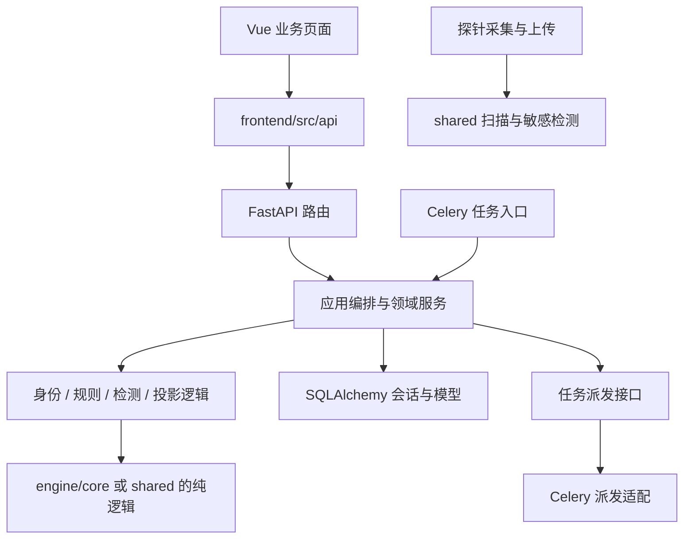

# 数据安全工具箱解耦操作指南

基线：2026-09-19，Git 标签 `v2.12.0`，发布提交 `d1c1569`。
本文件是后续实施指南；本轮只发布已有整改并编写文档，没有执行下述代码拆分。
发布状态、版本自报差异和测试限制见 [发布记录](releases/v2.12.0.md)。

## 1. 目标与实施原则

让常见修改可以定位到一个业务域，并通过该域的测试验证。保留 FastAPI、Celery、PostgreSQL、Redis、Vue
和探针现有部署方式，先建立清晰的模块边界。当前没有足够证据要求拆成微服务；增加网络调用、数据库和部署单元
会增加排障成本。文件变短只是结果，验收重点是依赖方向、事务边界和行为兼容。

一次提交只完成一种动作：移动职责、调整业务逻辑、修改表结构、修复历史数据必须分开。
先保留旧入口，再迁移调用方；每一步均可独立评审和通过普通 Git 提交回退。

所有路径相对仓库 `source/`。下文标注“拟新增”的目录尚不存在，不应当成已落地架构。

## 2. 实际耦合点与优先级

以下行数在发布前实际统计，后续会变化；函数名比行号更适合定位。

| 优先级 | 当前文件与证据 | 造成的修改成本 | 对应步骤 |
| --- | --- | --- | --- |
| P1 | `backend/app/api/v1.py` 2,822 行；同时处理鉴权、上传、查询、分析、告警、规则和报告 | 改一个页面接口需读多个业务域，导入整套分析任务 | B、C |
| P1 | `api/rulesets.py` 导入 `api/extensions.py::authenticated_probe`，`api/profiles.py` 导入 `queue_probe_data_asset_job`，v1 调用 `queue_probe_scan` | 路由互相依赖，拆路由容易出现循环导入 | B |
| P1 | v1 直接导入 `workers/tasks.py::_upsert_incident`；`services/test_service.py` 也导入任务模块 | HTTP 与 Celery 执行/入库细节绑定 | B、D |
| P1 | `services/data_object_service.py` 1,165 行，`ingest_report` 单函数 221 行 | 身份、覆盖度、检测合并、旧投影、查询混在一起 | E |
| P1 | `workers/tasks.py` 981 行，混合分析、关联、投递、扫描与清理 | 改一类任务可能影响队列注册和其他任务 | D |
| P2 | `models.py` 748 行，Alembic 直接导入其中 Base | 所有领域共用模型入口，草率拆分会漏注册表 | G |
| P2 | `PcapWorkbench.vue` 582 行，同时维护包、详情、文件、上传和轮询状态 | 修改一个视图可能破坏另一个异步请求的状态 | F |
| P2 | `probe/probe.py` 1,208 行、`probe/data_assets.py` 871 行；分发脚本显式枚举文件 | 探针拆文件后可能本地可运行、安装包却缺模块 | H |

已经存在并应保留的边界：`engine/core` 的引擎协议、`integrations` 适配器、`deployment` 下发/回收、
`services/pcap_files.py` 提取服务、`shared/scanning` 与 `shared/sensitive_detection`。
不为目录整齐重复建立第二套实现。

## 3. 目标依赖与责任表



- 路由负责认证、参数和响应；领域服务不导入 `app.api`，也不根据 HTTP 状态码作业务判断。
- worker 入口负责 Celery 注册、运行状态与调用；业务编排不依赖某个被装饰的 task 对象。
- 拟建立 `app/application/` 承载跨域分析/关联编排，`app/services/` 保留具体领域服务；只在确有跨域职责时引入应用层。
- 数据库事务由一个调用方拥有；下层可按当前语义 flush，但不能新增隐式 commit。
  现状 `data_object_service` 不 commit；`api/extensions.py` 接入报告后 commit。拆分时保持这个边界。
- 平台资产身份解析拟放 `app/domain/evidence_identity.py`；这与数据对象的文件身份是两个概念，不合并。
- 探针仍只采集、扫描、上传、心跳和受控命令。不得导入后端应用、告警关联、风险评分或报告代码。
- API、数据库表名、Celery task name、探针 JSON 协议都属于兼容边界，改内部文件路径不等于可以改这些外部标识。

## 4. 分阶段操作

### A. 固定基线与记录契约（先做）

1. 顺序阅读 `AGENTS.md`、`TASK.md`、`PROJECT_STATUS.md`、`docs/architecture.md`，核对真实 Git 状态。
2. 从已发布且工作区干净的提交创建任务分支。发布快照可用 `v2.12.0`，继续维护则从最新 `develop` 开始。
3. 记录受影响 API 的 method/path、参数、返回字段、状态码、鉴权方式、分页与排序。
   保存 OpenAPI 差异之外，还要检查路由列表是否重复；OpenAPI 字典可能掩盖重复 path 注册。
4. 记录 task name、queue、参数顺序、retry/time limit、装饰器顺序、beat 调度；保存当前 Alembic head。
5. 针对将移动的业务行为补最小契约测试。测试应捕获输入/输出和副作用，不只断言新函数存在。
6. 按第 5 节相同环境运行前后对照；区分基线失败和新增失败。

交付：一页范围说明、依赖清单、前后比较基线。没有基线时不开始批量搬迁。

### B. 先消除跨路由依赖和 worker 私有入口

1. 将 `extensions.py::authenticated_probe` 原样移入拟新增 `api/dependencies.py`，保留原函数签名。
   `extensions` 暂时重导出它，`rulesets.py` 改从新入口导入。不要把业务派发塞进 dependencies。
2. 将 `queue_probe_scan`、`queue_probe_data_asset_job` 的建任务逻辑移入现有 `services/probe_task_service.py`
   或其下按职责拆出的服务；保留现有权限前置条件、payload、状态、commit 时点。
   再把 `profiles.py` 和 v1 调用改到服务入口，旧路由模块只保留兼容转发。
3. 将 `_upsert_incident` 及其必要纯辅助函数抽到拟新增 `services/incident_service.py`，提供明确公开入口。
   API 与 worker 同时调用该服务；不能把 worker 对象整体转导入新服务以制造隐藏环。
4. 任务派发拟用 `application/task_dispatch.py` 的显式函数/协议表示，由独立 Celery 适配实现。
   先保留 `_dispatch` 的行为，包括同步回退、任务建档和失败记录；改变这些语义另立任务。
5. `services/test_service.py` 的任务执行依赖也迁到派发边界；生产导入禁用仍由原保护控制。

验收：探针鉴权、规则集获取、扫描配置派发与关联结果一致；没有新增 `services -> api` 依赖，
路由不再跨模块导入上述辅助函数，API 不再引用 worker 私有函数。先不要拆整个 v1。

### C. 按业务域逐个拆路由（PCAP、文件、平台资产、事件/情报、告警、任务/审计/报表、检测/引擎、看板/流量视图域 2026-09-20 已完成）

拟新增 `api/pcaps.py`、`api/files.py`、`api/assets.py`、`api/alerts.py` 等，避免与已有
`data_catalog.py`、`deployments.py`、`libraries.py`、`profiles.py`、`rulesets.py` 的职责重复。
第一批只选 PCAP 路由，随后一次一个域。

落地位置（PCAP 域）：路由与专用序列化在 `api/pcaps.py`（18 条路径，含文件末尾的兼容下载端点），
上传归属与队列背压在 `api/dependencies.py`（`upload_probe_id`、`enforce_queue_backpressure`），
Task 行序列化在 `api/task_presenter.py`，由 `v1.router` 只 include 一次；边界由
`tests/test_pcap_boundaries.py`（6 项）锁定，拆分前后 OpenAPI 字节一致。
落地位置（文件域）：路由与扩展名/MIME 过滤器在 `api/files.py`（5 条路径：上传、列表、详情、下载、重新分析），
`_serialize_file` 改名导出为 `serialize_file`；上传归属与 Task 行序列化复用 PCAP 批已下沉的
`api/dependencies.py::upload_probe_id`、`api/task_presenter.py::serialize_task`，派发走
`services/task_dispatch.dispatch_task_row`；边界由 `tests/test_file_boundaries.py`（7 项）锁定，
拆分前后 OpenAPI 字节一致。PCAP 内提取文件的预览/下载仍属 PCAP 域，不并入本域。
落地位置（平台资产域）：路由与资产行序列化在 `api/assets.py`（4 条路径：列表、汇总、关系、详情），
资产详情要返回的检测/事件/IOC 行序列化下沉到 `api/finding_presenter.py`、`api/incident_presenter.py`、
`api/ioc_presenter.py`，三者共用的时间归一化下沉到 `core/datetimes.py::aware`；边界由
`tests/test_asset_boundaries.py`（8 项）锁定，拆分前后 OpenAPI 语义一致。数据资产（`/data/assets`）仍属
`api/data_assets.py`，不并入本域。
落地位置（事件/情报域）：路由在 `api/incidents.py`（7 条路径），关联计算仍在 `incident_engine`、
归属重建在 `incident_engine.attribution`，行序列化复用既有 presenter，列表时间过滤下沉到
`api/query_filters.py::string_time_filter`；边界由 `tests/test_incident_ioc_boundaries.py`（8 项）锁定，
拆分前后 OpenAPI 排序后字节一致。
落地位置（告警域）：路由在 `api/alerts.py`（5 条路径：列表、汇总、SSE 流、详情、状态更新），抑制状态、
命中聚合与投递仍在 `services/alert_service.py`，探针行序列化下沉到 `api/probe_presenter.py::serialize_probe`，
规则解析下沉到 `api/rule_presenter.py::rule_definition`（`/rules` 路由与测试一并改到新位置）；边界由
`tests/test_alert_boundaries.py`（8 项）锁定，拆分前后 OpenAPI 排序后字节一致。
落地位置（任务/审计/报表域）：任务队列在 `api/tasks.py`（5 条路径：列表、创建、详情、停止、删除），
行创建/过期仍在 `services/task_service.py`、`services/probe_task_service.py`；审计与报表在
`api/reports.py`（5 条路径：日志分析、审计汇总、报告生成、报告列表、报告下载），内容仍由
`services/audit_service.py`、`services/report_service.py` 生成，报告行序列化随域下沉为
`serialize_report`（原 v1 `_serialize_report`）；边界由 `tests/test_tasks_reports_boundaries.py`（10 项）锁定，
拆分前后 OpenAPI 排序后字节一致（仅子路由注册顺序变化，路径集合与匹配结果不变）。
落地位置（检测/引擎域）：检测结果与引擎目录拆到 `api/detections.py`（3 条路径：检测列表、检测详情、
分析结果）与 `api/engines.py`（2 条路径：`/engine/registry`、`/engine/pipeline`）；行序列化与时间过滤
继续复用共享 presenter 与 `api/query_filters.py::string_time_filter`，引擎清单读 `app.engine.registry`、
规则清单走 `api/rule_presenter.py::rule_file_entries`，内部引擎名到 UI slug 的映射 `ENGINE_PRESENTATION`
随域下沉；边界由 `tests/test_detection_engine_boundaries.py`（9 项）锁定，拆分前后 OpenAPI 排序后字节一致。
落地位置（看板/流量视图域）：看板、风险总览、关系图与全局流量视图拆到 `api/dashboard.py`（13 条路径：
`/risk/summary`、`/graph`、`/dashboard/*` 九条、`/flows`、`/protocols`、`/network/live`）；数字仍由
`app/models.py` 实时聚合，行序列化复用资产/事件/流量/探针 presenter，协议分层复用
`services/protocol_service.py::protocol_layer`；边界由 `tests/test_dashboard_boundaries.py`（7 项）锁定，
拆分前后 OpenAPI 排序后字节一致。
其余域建议顺序：probes → integrations/offline → rules。
下列条目保留为当时的实施要求与验收口径。

1. 将该域的路由函数和专用序列化函数一起移动。PCAP 包括上传、包/流、DNS/HTTP/TLS、
   提取清单、预览、下载；同时核对文件末尾的兼容下载端点，不能按连续行区间直接剪切。
2. `pcap_files.py` 仍是服务；HTTP 文件归属检查、管理员认证和流响应仍在路由边界执行。
3. 新 router 只在一个聚合入口注册一次。可以暂由 `v1.router` include 子路由，待迁完再调整 main；
   不要在 v1 与 main 两边重复注册，`/api/v1` 前缀只叠加一次。
4. 保持静态路径和 `/{id}` 路由的匹配顺序。禁止借拆分修改响应结构或统一错误码。
5. 公用序列化按实际复用提取到各域 schema/serializer；不要新建一个继续膨胀的通用 `utils.py`。
6. 搜索旧导入与 monkeypatch 目标，迁移测试到真实查找位置；保留必要兼容转发直到所有调用方迁完。

验收：API 路径/方法集合不变且无重复，鉴权与分页不变；重复上传仍定位原 ID，
传输文件下载仍按抓包清单验证，缺包/加密/提取限制仍明确展示。运行 `test_pcap_workbench.py`。

### D. 拆分析编排，再拆 Celery 任务（2026-09-20 已完成）

落地位置：编排在 `application/analysis.py`，身份解析在 `domain/evidence_identity.py`，
任务行在 `services/task_service.py`，派发端口在 `services/task_dispatch.py`，
任务分模块为 `workers/{analysis,notification,maintenance}_tasks.py` + `task_runtime.py` + `task_names.py`，
旧 `workers/tasks.py` 仅兼容重导出；边界由 `tests/test_task_boundaries.py` 锁定。
下列条目保留为当时的实施要求与验收口径。

1. 将 `run_pipeline`、`_run_correlations_and_alerts`、`_recent_findings`、`_merge_findings`
   抽到拟新增 `application/analysis.py`。显式接收 db、context、task_id，不在模块导入时打开连接。
2. `_supersede_file_derivations` 随文件再分析编排管理，保留“旧结果 superseded、当前结果入库”的顺序与事务。
3. 将 evidence 身份解析从 `incident_engine/engine.py` 移到拟新增 `domain/evidence_identity.py`；
   旧路径重导出 `evidence_asset_keys`、`evidence_ioc_keys` 及确有调用的相关入口，原样保留语义。
   资产、告警、关联和去重消费同一实现；不要重新实现第二套 IP/IOC 解析。
4. 按职责拆成拟新增 `workers/analysis_tasks.py`、`notification_tasks.py`、`maintenance_tasks.py`；
   已有 `deployment_tasks.py` 保留。任务装饰器的显式 name 不改，args 顺序不改。
5. `celery_app.py` 的 include 一次性登记新模块；旧 `tasks.py` 可重导出任务对象，但不能重复装饰。
   校验 beat_schedule/task_routes 引用的名字全部已注册，部署任务仍走独占队列。
6. 在独立 Redis 与测试 worker 验证：一次成功、一次失败、重复投递、投递重试、任务停止。
   网络禁用单元容器只能验证纯逻辑，不能替代真实队列集成验证。

验收：同输入产生相同 Finding/Incident/Alert/AlertHit；抑制命中保留首次/最近/最高风险；
队列无 unregistered task，失败回滚与重试行为未变，不因拆分扩大事务或重复提交。

### E. 数据对象服务按纯逻辑、写入、投影、查询拆分

拟新增 `services/data_objects/` 包，旧 `data_object_service.py` 暂作兼容门面。

| 拟新增文件 | 从现有文件移动的内容 | 边界 |
| --- | --- | --- |
| `identity.py` | `normalise_path`、`resolve_identity`、对象/实例类型、scope key | 路径/哈希纯函数，不查库 |
| `coverage.py` | `in_scope`、`complete_scope`、迟到判定 | 覆盖度与时间纯函数，保持时区语义 |
| `ingestion.py` | `ingest_report`、检测/证据合并、`sweep_scope`、计数更新 | 接收同一 Session，写入方不私自 commit |
| `projection.py` | `project_asset`、`mark_projection_not_observed`、`rebuild_projection`、`backfill_legacy` | 旧 data_assets 是派生投影，不能反向成为新事实源 |
| `queries.py` | `data_type_rows`、`_type_scope`、`data_type_summary`、详情读取 | 统一分级覆盖与去重口径 |

先移纯函数并保留测试，再移 queries，然后 projection，最后 ingestion。
类别、状态、盐值等常量集中在包内定义，禁止各文件复制一份；不要在第一步就拆 221 行 ingest 算法。
门面从新模块导出符号，新模块不能反向 import 旧门面。只被一个模块使用的私有辅助函数随所属模块移动。

必须锁定：完整哈希才能确认同一对象；partial 身份是候选；完整扫描才能退休本 scope 的未观测实例；
迟到报告不能使当前实例退役；目录汇总不能凭空生成检测；对象计数按受影响对象集合重算；
`sample_size` 和 `sample_limit` 不能互换；旧投影分级不得弱于平台口径。

验收：`test_data_objects.py` 和 shared 扫描/真实性回归通过，重复报告、部分报告、迟到报告与重建的结果一致。
本阶段没有结构变更，不应产生 Alembic 迁移；历史回填不是解耦验收动作。

### F. 前端先抽状态，再抽视图

从 `modules/network/pcap/PcapWorkbench.vue` 开始，拟新增本域 `composables/` 与 `components/`。

1. 抽 `usePcapList`、`usePcapPackets`、`usePcapFiles`、`usePcapAnalysis`，每个只管理本域请求和状态。
2. 保留 `viewVersion`、`packetVersion`、`detailVersion`、`fileVersion`、`taskVersion` 的过期响应防护，
   明确切换抓包后哪些请求作废。不能用一个全局 loading 替换所有异步状态。
3. 轮询由一个 composable 拥有，切换记录与组件卸载时取消 timer；不要让父组件和子组件各轮询一次。
4. 展示组件通过 props/emits 通信，API 调用仍走 `frontend/src/api`；不在组件里拼第二套 HTTP 客户端。
5. 再以同样方式处理 DataAsset 等实际频繁改动页面；无复用需求时状态留在页面域内，不全塞 Pinia。

验收：重复上传定位、包分页、详情切换、文本/Hex、错误重试、离开页面停止轮询。
补一个慢请求后返回的交互回归，验证旧抓包响应不会覆盖新选中抓包；typecheck 与现有 34 项测试通过。

### G. 最后拆模型，保持同一 metadata

待调用边界稳定后，把 `models.py` 变为同名包 `models/`，按真实业务域拆分并由 `__init__.py`
重导出现有类。此步骤应单独提交，避免同名文件和目录并存。

1. Base 只定义一次；所有模型共用它。处理关系引用时采用已有 SQLAlchemy 支持的延迟引用，避免循环导入。
2. Alembic `env.py` 的 `from app.models import Base` 继续有效，入口要保证所有模型被注册。
3. 核对 Table 集合、列、索引、唯一约束、外键完全一致，运行 mapper 配置检查。
4. 对隔离 PostgreSQL 执行迁移一致性检查；仅拆 Python 文件不应出现 drop/create 表迁移。

验收：所有既有 `from app.models import ...` 可导入，metadata 不变，迁移 head 仍为 `0015_alert_hits`。
任何自动生成的删表/重建表差异都应停止并调查，不能当作“重构所需”提交。

### H. 探针模块化与分发（独立批次）

1. 从 `probe.py` 中逐步抽出配置、HTTP 传输、spool/上传、心跳和命令执行；主入口只装配生命周期。
2. `data_assets.py` 再按遍历、条目构建、数据库服务推断分开；敏感识别继续复用 shared。
3. 保持 HTTP headers、report schema 1.0/1.1、预算、停止语义、规则/配置版本与缓存键一致。
4. 新模块必须加入 `scripts/build_probe_packages.py` 的 FILES/TREES 清单；先分配新探针版本，
   同步 `probe.py:AGENT_VERSION`、`config.py:probe_agent_version` 与构建脚本 VERSION。
5. 构建 amd64/arm64 包，检查 manifest、SHA256、LF 行尾、可执行位以及全部 shared 文件。
   在隔离 Linux 主机安装/卸载验证；真实探针升级单独取得该主机操作授权。

验收：旧平台/新探针与新平台/旧探针兼容矩阵明确；本地 import 成功不代表交付包成功。
绝不扩大 `uninstall.sh` 删除白名单，不改变只读、旁路、不解密 TLS 的边界。

## 5. 验证方法与发布门槛

命令从 source 执行。工作目录已有改动时先确认来源，不回滚用户文件。

```powershell
git status
git log --oneline -10
git switch -c refactor/api-boundaries
rg -n 'from app.api|from app.workers' backend/app
rg -n '_upsert_incident|authenticated_probe|queue_probe_data_asset_job' backend/app backend/tests
git diff --check
Push-Location frontend
npm run typecheck
npm test -- --run
Pop-Location
```

本次发布回归的可复现隔离口径（使用现有镜像；不挂生产数据卷、不传生产 env）：

```powershell
$src = (Get-Location).Path
docker run --rm --network none `
  -v "${src}/backend/app:/app/app:ro" `
  -v "${src}/backend/tests:/app/tests:ro" `
  -v "${src}/backend/pyproject.toml:/app/pyproject.toml:ro" `
  -v "${src}/probe:/app/probe:ro" `
  -v "${src}/shared:/app/shared:ro" `
  -v "${src}/probe_packages:/app/probe_packages:ro" `
  -w /app source-backend:latest python -m pytest -q -o addopts= --tb=short
```

本口径 v2.12.0 为 579 passed / 17 failed，对照 d8676bc 为 541 passed / 17 failed，失败集合一致。
它有已知限制：distribution 测试按完整仓库布局寻找 `/probe` 等目录，挂载布局不匹配；
禁用网络时没有 Redis/worker 能力；Zeek 相对路径测试失败。不能用这个口径证明打包和队列正确。
后续相关改动要另外准备完整仓库布局、隔离 Redis/worker 和有效分发包，并固定同样环境作前后对比。

| 改动域 | 首选回归文件/方式 |
| --- | --- |
| 路由/鉴权 | `backend/tests/test_api.py`，以及变更域的鉴权与响应契约；逐项比较基线失败 |
| PCAP | `test_pcap_workbench.py`、`test_protocol_service.py`、`test_protocol.py` |
| 关联与告警 | `test_alerts.py`、`integrations/test_incident_engine.py`、`e2e/test_continuous_detection.py` |
| 数据对象 | `test_data_objects.py`、`shared/test_detection_truthfulness.py`、`shared/test_scanning_coverage.py` |
| 引擎判定 | 对应 `engine/test_*.py`、`integrations/test_*.py`，保留输入输出证据 |
| 前端 | `frontend/src/__tests__/pcap-workbench.test.ts`、typecheck、全量 vitest |
| 分发/探针 | `deployment/test_package.py`、`shared/test_distribution.py`、隔离安装验证 |

每个 PR 必须说明：移动了哪些职责、旧入口如何兼容、事务在哪里提交、影响哪些契约、测试结果与基线差异。
纯移动阶段的门槛是行为不变、无新增测试失败；修改了判定逻辑就应拆成另一 PR。
已有失败可以明确记录，但不能把新增失败自动归入环境问题。

上线检查只使用真实数据与已授权只读接口。禁止调用 `POST /api/v1/test/import`，生产构建禁止
`VITE_DEMO_MODE=true`。测试夹具只运行在隔离测试环境，不能流入交付库。

## 6. 每一步回退与兼容入口清理

- 单批次失败先停止后续拆分，保留日志；对已提交的该批改动使用普通 revert 提交，禁止重写公共历史。
- 路由和任务兼容入口至少保留到仓内调用迁完，并确认没有待执行消息依赖旧参数；不能以 rg 无命中替代队列核验。
- 删除兼容门面前，搜索源码、测试 monkeypatch、构建脚本、部署命令、文档与外部消费者，明确剩余风险。
- 纯模块移动不做数据库 downgrade、不执行投影重建、不回填告警；这些会改变真实数据，需独立变更与备份方案。
- 构建继续遵守 AGENTS.md 的 legacy builder 约束。只更新受影响镜像，但有共享代码变更时同步验证 API/worker/探针包。

## 7. 后续日常修改快速定位

| 想改什么 | 先看什么 | 必须顺带核对什么 |
| --- | --- | --- |
| 页面布局/交互 | `frontend/src/modules/<业务域>` | API 返回不变；异步状态与取消逻辑 |
| API 筛选/分页 | 对应 `api` 路由及 `frontend/src/api` | 全量总数、排序、鉴权，禁止用当前页数量冒充总数 |
| 敏感识别/扫描预算 | `shared/sensitive_detection`、`shared/scanning` | 平台与探针双端回归、分发包版本 |
| 对象身份/计数 | `services/data_object_service.py`（拆后为 data_objects 包） | partial/迟到/退休/旧投影一致性 |
| 告警去重/关联 | `alert_service.py`、`incident_engine`、任务编排 | fingerprint、AlertHit、历史 superseded、证据身份 |
| 引擎规则展示 | `rules/catalog.py`、`library.py`、`code_catalog.py` | 资源数与签名数单位、命中快照与当前定义 |
| PCAP 提取 | `services/pcap_files.py`、协议服务、分析任务 | 原始字节、归属校验、资源上限与不完整说明 |
| 探针部署/回收 | `deployment/`、`deployment_tasks.py`、打包脚本 | 状态机、独占队列、删除白名单与真实主机授权 |

建议第一张实施任务只做 B 的鉴权依赖和探针任务服务提取，完成后再拆 PCAP 路由。
每完成一批，在 TASK 中只保留当前目标/结果/下一步；旧过程移入明确历史区，并同步 PROJECT_STATUS 与 architecture。
用“定位过的文件数、单次跨域改动数、回归耗时、返工原因”记录连续三次任务的变化；
行数下降但改动仍跨多个域时，应继续调整边界，不宣称效率已经提高。
